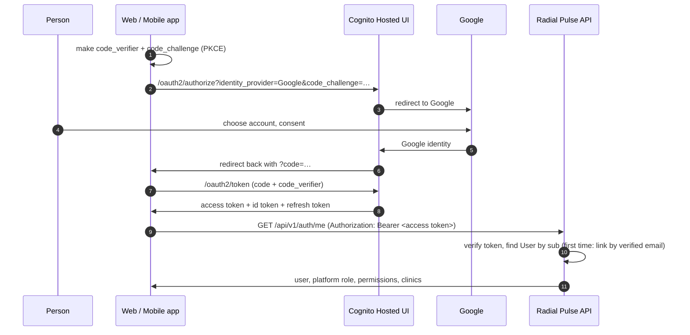
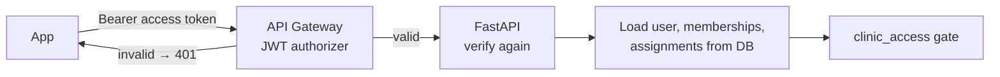

# Authentication

**Cognito + Google sign-in + PKCE + API Gateway JWT validation.**
There is no username/password form of our own and no fake login anywhere.

## Sign-in flow (web and mobile)

- **PKCE** replaces a client secret. Both app clients in Cognito are _public_ (no secret).
- Web: `react-oidc-context` / `oidc-client-ts` (`apps/web/src/features/auth`). Tokens in
  `sessionStorage` (cleared when the tab closes).
- Mobile: `expo-auth-session` (`apps/mobile/src/features/auth`). Tokens in the OS secure
  store (Keychain / Keystore).

## Token flow on every API call

What the API checks (`app/core/security.py`):

| Check      | Rule                                                 |
| ---------- | ---------------------------------------------------- |
| Signature  | RS256 only, key from the user pool's JWKS (cached)   |
| Issuer     | Must be our user pool                                |
| Expiry     | `exp`/`iat` with 30 s leeway                         |
| Token type | `token_use` must be `access` (ID tokens are refused) |
| Client     | `client_id` must be our web or mobile app client     |

Why check twice? API Gateway protects the edge; the API must never trust the network
hop, and local/dev traffic may bypass the gateway.

## Invite-only accounts

Radial Pulse is sold outbound: nobody signs themselves up.

0. The **first** Platform Administrator is created once from the command line:
   `make create-admin --email=… --name=…` (in AWS: a one-off ECS task).
1. A **Platform Administrator** pre-creates Digital Success Managers (`POST /api/v1/users`)
   and assigns them to clinics.
2. A **Digital Success Manager** onboards a clinic and adds its Clinic Administrator(s)
   (`POST /clinics/{id}/team`). (Clinic Team Members come later.)
3. On a person's **first** Google sign-in, the API sees an unknown `sub`, calls Cognito's
   `/oauth2/userInfo` for the **verified** email, and links it to the pre-created user.
4. Unknown or unverified emails get **403 `not_provisioned`**. An email already linked to
   a different Google identity is also refused.

(Cognito itself may create a user record on first Google sign-in; that grants nothing
in Radial Pulse. A Cognito pre-sign-up trigger to block unknown emails is listed in
[decisions.md](decisions.md).)

## Authorization

Authentication says **who** you are. Authorization — **what** you may do — is decided
only by the API from the database: see [multi-tenancy.md](multi-tenancy.md).

| Role                    | Stored as                                         | Access                                        |
| ----------------------- | ------------------------------------------------- | --------------------------------------------- |
| Platform Administrator  | `platform_administrator`                          | Everything, every clinic                      |
| Digital Success Manager | `digital_success_manager` + assignment            | Assigned clinics only (+ onboard new clinics) |
| Clinic Administrator    | `clinic_user` + membership `clinic_administrator` | Only their own clinic(s)                      |
| Clinic Team Member      | `clinic_user` + membership `clinic_team_member`   | Reserved — no access yet                      |

## Human identity vs service identity

People authenticate with Cognito (above). The background **worker** is not a person: AWS
authenticates it through its own ECS task role, it logs in to the database with its own
IAM-authenticated user, and it acts as a `ServicePrincipal` limited to one clinic per job.
It never uses or impersonates a human's token. Details:
[background-jobs.md](background-jobs.md#service-identity).

## Local development

Point the apps and API at the **DEV** Cognito user pool (values are public ids, not
secrets). Without them, the web/mobile apps run in an "auth not configured" mode for
layout work and every protected API endpoint answers **503** — never a bypass.
Automated tests sign real JWTs with a throwaway RSA key and use the production verifier.
