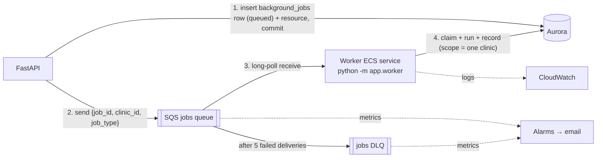

# Background jobs and the worker

Slow, retryable or failure-prone work does **not** run inside an HTTP request. The API
records a job and returns immediately (`202`); a separate worker process does the work.

## What goes to the queue (and what doesn't)

| Work                                                                 | Background job? | Why                                   |
| -------------------------------------------------------------------- | --------------- | ------------------------------------- |
| Digital Presence Assessment (crawling, enrichment, engines)          | **Yes — built** | minutes long, external calls, retries |
| Social / GBP metric sync, scheduled re-assessments (every 1–2 weeks) | Yes — later     | scheduled + external APIs             |
| Report PDF export, media processing                                  | Yes — later     | CPU heavy                             |
| Emails / push notifications                                          | Maybe later     | only if a provider is slow/unreliable |
| Upload confirmation, profile edits, approvals, reads                 | **No**          | fast, must answer the user now        |

Only one job type exists today: `assessment.run`. Add types to `JobType` and a handler in
`app/worker/runner.py` — not a new queue.

## Architecture



- **One queue + one DLQ** (Terraform `modules/queue`, KMS-encrypted, TLS-only).
- **Locally** there is no SQS: `JOB_QUEUE_BACKEND=database` makes the worker poll
  `background_jobs` (`make worker`). Tests use an in-memory queue.

## Message contract (v1)

```json
{ "schema_version": 1, "job_id": "uuid", "clinic_id": "uuid", "job_type": "assessment.run" }
```

Ids only — never data, tokens or personal information. A breaking change bumps
`schema_version`; the worker rejects versions it does not know.

## Reliability rules

| Concern             | How                                                                                                                                                                                                                                   |
| ------------------- | ------------------------------------------------------------------------------------------------------------------------------------------------------------------------------------------------------------------------------------- |
| **Idempotency**     | The `background_jobs` row decides. Messages for jobs already `succeeded`/`failed` are acknowledged and ignored (SQS delivers at-least-once). Engine results are written with replace-semantics, so a retry never duplicates findings. |
| **Claim**           | Conditional `UPDATE … WHERE status IN ('queued','running')` that also counts the attempt. `running` is claimable because a crashed worker's message returns after the visibility timeout (15 min).                                    |
| **Retries**         | Failure below `max_attempts` (5) → job back to `queued`, message not acknowledged → SQS redelivers after the visibility timeout.                                                                                                      |
| **Giving up**       | At `max_attempts` → job `failed`, assessment `failed`, audit event `job.failed`, message acknowledged.                                                                                                                                |
| **Dead letters**    | Anything that crashes the process repeatedly moves to the DLQ after `maxReceiveCount` (5). The DLQ alarm fires on the first message. Fix the cause, then redrive from the SQS console.                                                |
| **Enqueue failure** | The API commits the job first, then sends. If sending fails the job is marked `failed` and the API answers 503 — never a silent stuck job.                                                                                            |
| **Shutdown**        | ECS sends SIGTERM; the worker finishes the current message (stop timeout 120 s).                                                                                                                                                      |

## Service identity

The worker is a **machine**, not a user:

- its own ECS task role: SQS receive/delete, KMS decrypt, `rds-db:connect` as `radial_worker_iam` — nothing else;
- its own database login (member of the restricted `radial_app` role, row-level security applies);
- in code, a `ServicePrincipal(name="assessment-worker", clinic_id=…)` with a fixed permission
  set, scoped to the job's clinic, and the DB scope set to that one clinic;
- audit rows it writes say `actor_type = service`.

A message whose `clinic_id` does not match the job row is skipped (no cross-tenant work).

## Observability

- Worker logs are JSON in the same CloudWatch log group as the API, with `job_id` as the
  request id on every line.
- Alarms: oldest message age > 15 min, any DLQ message, worker not running, ERROR log lines.
- `background_jobs` shows status, attempts and the last error (truncated, no secrets).

## Not built (on purpose)

- Queue-depth autoscaling for the worker (one task is enough today).
- Scheduled jobs — use EventBridge Scheduler → API or SQS when re-assessments are designed.
- Step Functions / multiple queues / a general agent framework — not justified yet.
