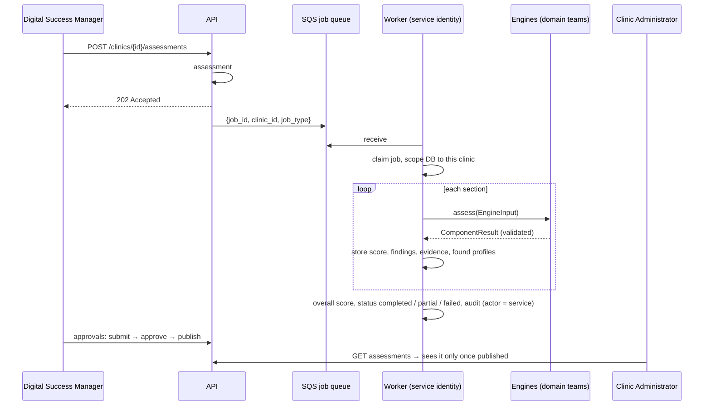

# Digital Presence Assessment

**Product decision:** Website + SEO + Local SEO + GBP + AEO + GEO + Social →
**ONE unified Digital Presence Assessment.** Clinics never get separate "SEO report",
"GBP report", "AEO report" and so on. They get one assessment with sections.

```
Digital Presence Assessment  (per clinic, numbered 1, 2, 3 …)
│   overall score · status · methodology version · approval/publication state
├── Website
├── Google Business Profile
├── Local Search
├── Search Readiness        (SEO + AEO + GEO readiness, shown as one section)
├── Social Presence
└── Competitor Benchmark
       each section: score · status · summary · engine name+version · findings
       each finding: code · title · priority · description · recommendation · evidence[]
       each evidence item: source URL · short excerpt · provider · observed time
```

## Two layers, kept apart

|              | Internal (engines)                                               | User-facing (the product)                                     |
| ------------ | ---------------------------------------------------------------- | ------------------------------------------------------------- |
| Owned by     | domain teams (SEO, GBP, social, …)                               | Central Tech (shape) + product owner (sections, scoring)      |
| Changes when | an engine improves                                               | a product decision is made                                    |
| Lives in     | engine packages, run by the worker                               | `assessments`, `assessment_components`, `assessment_findings` |
| Contract     | `EngineInput` → `ComponentResult` (`app/assessments/engines.py`) | `GET /clinics/{id}/assessments/{id}`                          |

Engines can be rewritten, replaced or split without changing the product model, as long as
they return a valid `ComponentResult` for their section.

## Lifecycle



- A section with no deployed engine is stored as `not_available` (reason `no_engine_deployed`).
  No fake scores are ever produced.
- An engine that returns invalid output fails **its** section (`invalid_engine_output`), not the run.
- Status: all sections completed → `completed`; some → `partial`; none → `failed`.
- Only a finished (`completed` / `partial`) assessment can be submitted for review.
- Only one assessment per clinic can be in progress (`409` otherwise).

## Scoring (placeholder — needs product-owner approval)

`overall_score` = equal-weight mean of the sections that completed (`app/assessments/scoring.py`).
Every assessment stores `methodology_version` (setting `ASSESSMENT_METHODOLOGY_VERSION`,
currently `2026.09-v0`). **Change the scoring or the section list → bump the version**, so old
assessments stay explainable.

## Evidence and grounding

- `critical` and `high` findings **must** carry at least one evidence item (validated).
- Evidence = source URL, a short excerpt (max 1,000 characters), provider, time observed.
  Never whole pages, never screenshots of personal data, never credentials.
- Findings also record which engine and engine version produced them (on the section), and
  the assessment records the methodology version.

## Presence profiles (where the clinic is online)

One generic table, `presence_profiles`, with a `platform` column (website, GBP, Instagram,
Facebook, YouTube, LinkedIn, X, Practo, Justdial, other). Finder engines add profiles as
**unverified** (with confidence and evidence); a Digital Success Manager or Clinic
Administrator confirms or rejects them. Engines never overwrite a person's decision.
Adding a platform = add an enum value + a small migration for the CHECK constraint.
Metrics for these profiles go to `metric_snapshots` (`source` = the platform).

## Building an engine (domain teams)

```python
from app.assessments.engines import AssessmentEngine, ComponentResult, EngineInput
from app.core.enums import AssessmentComponentKey, ComponentStatus

class GbpEngine:
    name = "gbp-engine"
    version = "0.1.0"
    component = AssessmentComponentKey.GOOGLE_BUSINESS_PROFILE

    def assess(self, data: EngineInput) -> ComponentResult:
        ...  # call your GBPProvider, analyze, return findings with evidence
        return ComponentResult(status=ComponentStatus.COMPLETED, score=72, findings=[...])
```

Ship it as its own Python package and declare an entry point:

```toml
[project.entry-points."radial_pulse.assessment_engines"]
gbp = "gbp_engine:GbpEngine"
```

Rules: engines receive business facts only, never touch the database, S3 or the platform
API, and keep external providers (`GBPProvider`, `SocialProvider`, `DirectoryProvider`,
`WebsiteProvider`) behind their own interfaces. For websites: plain HTTP + HTML parsing
first; Playwright only for pages that need JavaScript, in a separate engine image.
Details: [background-jobs.md](background-jobs.md).

## Report artifacts are not assessments

`report_artifacts` remains for **files and other outputs** (an exported PDF of an assessment —
linked by `assessment_id` —, website briefs, generated videos). Never use it to create
per-channel audit reports.
