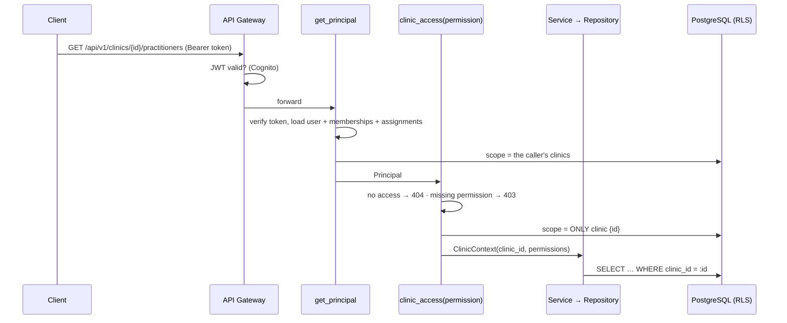

# Multi-tenancy, roles and access control

**The clinic is the tenant.** Clinic A must never see or change Clinic B's data — not by
changing an id in a URL, not through a list, not through a bug that forgets a filter.
Two layers enforce this, and they check each other:

1. **Application layer** — one role → permission table and one gate per request.
2. **Database layer** — PostgreSQL row-level security (RLS) on every clinic-scoped table.

## Roles

| Role (product name)           | Stored as                                                                              | Who                        | Clinics                                    |
| ----------------------------- | -------------------------------------------------------------------------------------- | -------------------------- | ------------------------------------------ |
| **Platform Administrator**    | `users.platform_role = platform_administrator`                                         | Central team               | all                                        |
| **Digital Success Manager**   | `users.platform_role = digital_success_manager` + a row in `clinic_assignments`        | internal Radial Pulse user | assigned clinics only                      |
| **Clinic Administrator**      | `users.platform_role = clinic_user` + `clinic_memberships.role = clinic_administrator` | clinic-side administrator  | their clinic(s) only                       |
| **Clinic Team Member**        | `users.platform_role = clinic_user` + `clinic_memberships.role = clinic_team_member`   | clinic staff               | their clinic(s): view-only + uploads       |

- A **practitioner (doctor) is not a role.** Practitioners are records in `practitioners`. A practitioner gets a login only if
  someone links one, and even then is not automatically a Clinic Administrator.
- An owner of several branches gets a Clinic Administrator membership in each branch.
- `clinic_user` is a technical platform role meaning "access comes only from memberships".
- Machines (the background worker) are **not** users: see "Service identity" below.

## Role → permissions → scope

Generated from `app/core/rbac.py` (the only place these are defined).
**Proposed defaults — see [decisions.md](decisions.md).**

| Permission                  | Platform Administrator | Digital Success Manager (assigned) | Clinic Administrator | Worker (service) |
| --------------------------- | :--------------------: | :--------------------------------: | :------------------: | :--------------: |
| `clinics:read`              |           ✓            |                 ✓                  |          ✓           |        ✓         |
| `clinics:write`             |           ✓            |                 ✓                  |          ✓           |                  |
| `clinics:manage` (stages, archive) |    ✓            |                 ✓                  |                      |                  |
| `team:manage` (Clinic Administrators only) | ✓      |                 ✓                  |   ✓ (own clinic)     |                  |
| `practitioners:read`        |           ✓            |                 ✓                  |          ✓           |                  |
| `practitioners:write`       |           ✓            |                 ✓                  |          ✓           |                  |
| `profile:read`              |           ✓            |                 ✓                  |          ✓           |        ✓         |
| `profile:write`             |           ✓            |                 ✓                  |          ✓           |                  |
| `presence:read`             |           ✓            |                 ✓                  |          ✓           |        ✓         |
| `presence:write`            |           ✓            |                 ✓                  |          ✓           |        ✓         |
| `assets:read`               |           ✓            |                 ✓                  |          ✓           |                  |
| `assets:upload`             |           ✓            |                 ✓                  |          ✓           |                  |
| `assessments:read`          |           ✓            |                 ✓                  |          ✓           |                  |
| `assessments:request`       |           ✓            |                 ✓                  |                      |                  |
| `assessments:write_results` |                        |                                    |                      |        ✓         |
| `reports:read`              |           ✓            |                 ✓                  |          ✓           |                  |
| `reports:write`             |           ✓            |                 ✓                  |                      |                  |
| `approvals:submit`          |           ✓            |                 ✓                  |                      |                  |
| `approvals:decide`          |           ✓            |                 ✓                  |          ✓           |                  |
| `approvals:publish`         |           ✓            |                 ✓                  |                      |                  |
| `work_items:read`           |           ✓            |                 ✓                  |          ✓           |                  |
| `work_items:write`          |           ✓            |                 ✓                  |                      |                  |
| `snapshots:read`            |           ✓            |                 ✓                  |          ✓           |        ✓         |
| `snapshots:write`           |           ✓            |                 ✓                  |                      |        ✓         |
| `audit_log:read`            |           ✓            |                 ✓                  |          ✓           |                  |

| Platform-level permission | Platform Administrator | Digital Success Manager | Clinic user |
| ------------------------- | :--------------------: | :---------------------: | :---------: |
| `clinics:create`          |           ✓            |            ✓            |             |
| `users:read`              |           ✓            |                         |             |
| `users:manage`            |           ✓            |                         |             |
| `assignments:manage`      |           ✓            |                         |             |

Extra rules enforced in services:

- Clinic Administrators only ever see **published** assessments and reports.
- Only Radial Pulse staff can add Clinic Administrators, deactivate a clinic, or publish.
- Only Platform Administrators create Radial Pulse staff accounts and assign Digital Success Managers.
- A Digital Success Manager who onboards a clinic is assigned to it automatically.
- Clinic users can be added only through a clinic's team, never as Radial Pulse staff (and vice versa).

## Layer 1 — the application gate

- Every `/clinics/{clinic_id}/…` route depends on `clinic_access(Permission.X)`
  (`app/dependencies/tenancy.py`). No access → **404** (we don't reveal the
  clinic exists); missing permission → **403**.
- Repositories always take `clinic_id` and filter on it (`get_in_clinic(clinic_id, id)`).
- Ids pointing at other rows (an asset in a report, a work-item owner, a resource to
  approve) are checked to belong to the same clinic.
- `tests/api/test_tenant_isolation.py` calls every clinic route as a user of another clinic.

## Layer 2 — row-level security (migration 0004)

**Database connection model.** The API and the worker log in as members of the non-owner
role `radial_app` — in AWS as `radial_api_iam` / `radial_worker_iam` using IAM database
authentication (no password exists); locally as `radial_app_local`. Only migrations log in
as the table owner (the Aurora master user / local `radial`), and RLS does not restrict owners.

**Tenant context propagation.** `app/db/tenant.py` keeps the scope on the SQLAlchemy session
and, at the start of **every transaction**, runs
`set_config('app.clinic_ids', …, true)` / `set_config('app.all_clinics', …, true)`, and the
signed-in person `app.user_id` / `app.is_staff` (migration 0007, `set_current_user`).
`true` = transaction-local, so pooled connections never carry one request's scope into the next.

| Moment                       | Scope set                                                         |
| ---------------------------- | ----------------------------------------------------------------- |
| Before sign-in is resolved   | none → no clinic rows visible (fail closed)                       |
| After `get_principal`        | the caller's accessible clinics (all for Platform Administrators) |
| After `clinic_access`        | exactly the one clinic in the URL                                 |
| Worker processing a job      | exactly the job's clinic                                          |
| Clinic creation (authorized) | widened by the new clinic's id just before the insert             |

**Policies.** One policy per table: `rp_all_clinics() OR clinic_id = ANY (rp_clinic_ids())`,
for reading **and** writing (a row cannot be inserted into, or moved to, another clinic).

**Every table is under RLS** (migration 0007 closed the gap on the identity tables).

| Tables | Rule |
| --- | --- |
| `clinics`, `clinic_practitioners`, `clinic_stage_history`, `clinic_profiles`, `consent_records`, `assets`, `approvals`, `work_items`, `metric_snapshots`, `report_artifacts`, `assessments`, `assessment_components`, `assessment_findings`, `presence_profiles`, `background_jobs`, `audit_events` | the tenant rule above |
| `practitioners` (the person, per business) | linked to a clinic in scope, or the same business owns a clinic in scope |
| `users` | yourself · created by you · staff seeing staff · has a membership/assignment in scope · all |
| `organizations` | owns a clinic in scope · created by you · all |
| `clinic_memberships`, `clinic_assignments` | clinic in scope, or the row is yours (read); clinic in scope (write) |
| `notifications` | yours (or all) |

**Sign-in before the user is known.** `resolve_principal` uses two `SECURITY DEFINER`
functions, `rp_user_id_by_sub(sub)` and `rp_user_by_email(email)`, that return **only the id
and platform role**. It then sets `app.user_id` and loads the full user through RLS.

`audit_events`: clinic events follow the tenant rule; platform events (`clinic_id` NULL) can be
written by the app but read only with the all-clinics scope. The app role also has **no
UPDATE/DELETE** on `audit_events` (plus the append-only trigger). The only deletes are by the
monthly archive job (owner login, `app.archiving = on`), after the rows are copied to S3 —
see `docs/infrastructure/archiving.md`.

**Migrations.** New clinic-scoped tables must enable RLS in the same migration.
`tests/integration/test_rls.py::test_every_table_has_row_level_security` fails
otherwise (every table except `alembic_version`). `ALTER DEFAULT PRIVILEGES` grants `radial_app` DML on new tables automatically.

**Local development.** `docker compose` creates the roles (`scripts/db/init-local-db.sql`).
Use `DATABASE_URL` (app role) for the API/worker and `MIGRATION_DATABASE_URL` (owner) for Alembic.

**Testing.** The PostgreSQL suite builds the schema as the owner and runs the API as a
non-owner member of `radial_app`, so RLS is exercised by every API test. SQLite (fast path)
has no RLS — that is why CI always runs the PostgreSQL suite.

**What RLS does not protect against.** Code running as the app role can set the scope
variables itself; RLS catches _mistakes_ (a missing `WHERE`), not a compromised API process.
The application gate stays the primary control.

## Service identity (machines are not users)

|                    | Human                          | Service (worker)                         |
| ------------------ | ------------------------------ | ---------------------------------------- |
| Authenticated by   | Cognito (Google, PKCE) → JWT   | AWS: its own ECS task role               |
| Database login     | `radial_api_iam` (via the API) | `radial_worker_iam`                      |
| In code            | `Principal`                    | `ServicePrincipal(name, clinic_id)`      |
| Scope              | the permission table above     | one clinic per job, fixed permission set |
| Audit `actor_type` | `user`                         | `service` (+ service name)               |

The worker never impersonates the person who requested a job. If another team's service ever
needs to call the API over HTTP, it gets a Cognito client-credentials client with scoped
permissions — designed, not built yet ([decisions.md](decisions.md)).
