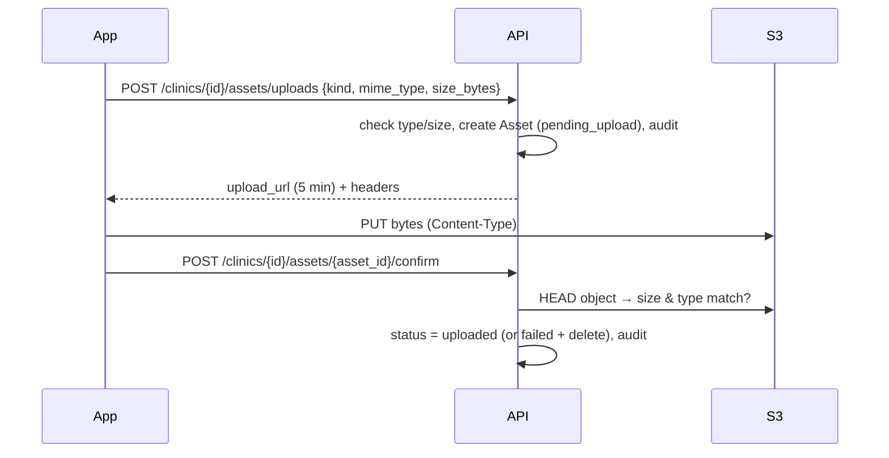
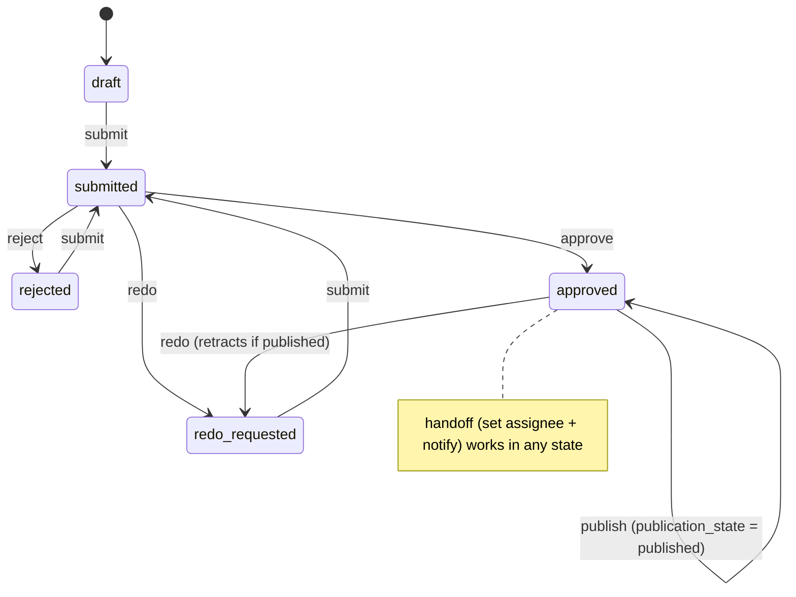

# Platform contracts (team interfaces)

Central Tech owns **tenancy, identity, security, reusable platform capabilities,
infrastructure, shared contracts and delivery**. Other teams own their domain logic
(how the search-readiness section is scored, how a video is edited). They plug in through these
contracts. All are tenant-scoped (`/api/v1/clinics/{clinic_id}/…`) and audited.

| Contract                        | Endpoint(s)                                                              | Status       |
| ------------------------------- | ------------------------------------------------------------------------ | ------------ |
| Client context                  | `GET/PUT /clinics/{id}/profile`                                          | ✅ built     |
| Where the clinic is online      | `GET/POST /clinics/{id}/presence-profiles`, `PATCH …/{profile_id}`       | ✅ built     |
| **Digital Presence Assessment** | `POST/GET /clinics/{id}/assessments`, `GET …/{assessment_id}`            | ✅ built     |
| Assessment engines              | `AssessmentEngine` interface, run by the worker (no HTTP)                | ✅ interface |
| Data ingestion                  | `POST/GET /clinics/{id}/snapshots`                                       | ✅ built     |
| Outputs (files/exports)         | `POST/GET /clinics/{id}/reports`                                         | ✅ built     |
| Assets                          | `/clinics/{id}/assets/uploads`, `/confirm`, `/download-url`              | ✅ built     |
| Governance                      | `POST /clinics/{id}/approvals/actions`, `GET /clinics/{id}/audit-events` | ✅ built     |
| Work status                     | `/clinics/{id}/work-items`, `/notifications`                             | ✅ built     |
| Chat                            | `/clinics/{id}/chat`                                                     | 🔒 reserved  |

The OpenAPI document (`openapi/openapi.json`) is the exact contract.

## 1. Client context — the governed client profile

One place for: **brand** (tagline, tone, colors, logo), **audience** (segments,
languages, service areas), **services**, **schedule** (opening hours), plus read-only
**consents**, **approved assets** and **team roles**.

- Read it; **do not copy it** into your own store. Cache for minutes at most.
- Writes replace whole sections and must send the `version` you read (optimistic
  locking → `409` if someone changed it meanwhile).
- Sections reject unknown fields. Need a new field? Ask Central (Person 1) to add it.

## 1b. Digital Presence Assessment and engines

The one user-facing assessment. Domain teams contribute **engines** (one per section) that
the worker runs; the platform validates and stores their results. Full contract:
[digital-presence-assessment.md](digital-presence-assessment.md). Engines never call the
API or the database — so they cannot bypass authorization.

## 1c. Presence profiles

Where the clinic is online, one table for every platform. Finder engines add them as
`unverified`; people confirm or reject. Read them from the API; don't keep your own list.

## 2. Data ingestion — metric snapshots

A snapshot is one normalized data point with its freshness and error state:

```json
{
  "source": "google_business_profile",
  "metric_key": "gbp.review_count",
  "value": { "value": 128 },
  "schema_version": 1,
  "fetched_at": "2026-09-25T06:00:00Z",
  "status": "ok", // ok | stale | error | pending
  "error_code": null,
  "error_message": null,
  "retry_count": 0,
  "next_retry_at": null
}
```

- `metric_key` is dotted and owned by the producing team (`gbp.*`, `gsc.*`, `site.*`,
  `ig.*`). Change the meaning of a value → bump `schema_version`.
- Errors are data too: record failed fetches with `status: "error"` so dashboards can
  show freshness honestly.
- Batches of up to 500 per request.

## 3. Outputs — report artifacts (files, not the assessment)

A report artifact is **one version** of a generated file (an exported assessment PDF —
linked by `assessment_id` —, a website brief, a video). It is never a per-channel audit
report: audit results are always sections of the Digital Presence Assessment.
Fields:
`report_type`, `report_key` (logical id across versions), auto-incremented `version`,
`provenance` (who/what produced it, from which inputs), `owner`, `asset_id` (the stored
file), `approval_state`, `publication_state`, `published_at`.

Clinic users only ever see **published** artifacts.

## 4. Assets — direct upload to S3



Asset metadata: clinic, owner, kind, MIME type, size, storage key
(`clinics/{clinic_id}/{kind}/{asset_id}.{ext}` — never the user's filename), version
(+ previous version), provenance, approval state, status, timestamps.

## 5. Governance — approvals and audit

One small state machine for anything reviewable:



| Action                  | Needs permission    |
| ----------------------- | ------------------- |
| submit                  | `approvals:submit`  |
| approve / reject / redo | `approvals:decide`  |
| publish                 | `approvals:publish` |
| handoff                 | `approvals:submit`  |

- `resource_type` must be **registered** in `app/services/governance.py`
  (currently `assessment`, `report_artifact`, `asset`). An assessment can only be submitted
  once it finished. Registration proves the resource exists in the
  same clinic and mirrors the state onto it. Teams add theirs (`website_brief`,
  `video_job`, …) with a ~10-line handler.
- Every action writes an **audit event**: actor, time, action, resource, tenant, request
  id, small metadata. The `audit_events` table is **append-only** (a PostgreSQL trigger
  blocks UPDATE/DELETE).

## 6. Work status — work items and notifications

Work items: `kind` (team-defined), title, status (`todo → in_progress → in_review → done`,
`blocked`, `cancelled`), priority, owner, due date, optional approval link, source team.
Changing the owner is a **handoff**: the new owner gets an in-app notification.
Each team owns the meaning of its `kind`s and when to move them.

## Machine-to-machine access

- **Built:** the background worker is a service identity (own AWS role, own DB login,
  `ServicePrincipal` scoped to one clinic per job). See [background-jobs.md](background-jobs.md).
- **Not built yet:** a domain team's _remote_ service calling the API over HTTP. When one
  exists it gets a Cognito client-credentials app client with scoped permissions and a
  `service` principal type in the API — never a shared human account.
