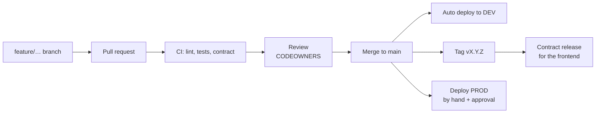

# Git workflow

Simple trunk-based flow. No `develop` branch, no release branches.



## Branches

| Prefix     | For                      | Example                        |
| ---------- | ------------------------ | ------------------------------ |
| `feature/` | New behaviour            | `feature/clinic-doctors-tab`   |
| `fix/`     | Bug fixes                | `fix/profile-version-conflict` |
| `chore/`   | Tooling, deps, refactors | `chore/bump-fastapi`           |
| `docs/`    | Documentation only       | `docs/auth-flow`               |

`main` is protected: no direct pushes, PR + passing `CI passed` check + 1 review
(CODEOWNERS for owned paths). Squash-merge.

## Commits

Conventional Commits, checked by the `commit-msg` hook:

```
feat(api): add doctors endpoint
fix(web): keep clinic filter on refresh
infra(dev): turn on budget alerts
```

Types: `feat fix chore docs refactor test perf build ci infra revert`.
Scopes: `api`, `db`, `contract`, `worker`, `ci`, `docs`, `repo`.

## Checks before you push

Run `make check` (lint, format, types, fast tests, contract). Heavy checks (PostgreSQL suite,
security scans, Docker build) run in CI.

## Releases

**Contract for the frontend:** after merging, `git tag vX.Y.Z && git push origin vX.Y.Z`
(the tag must equal `CONTRACT_VERSION`). GitHub creates the release with `openapi.json`.
See [contract-versioning](../api/contract-versioning.md).

**PROD:** Actions → *Deploy PROD* → Run workflow with the tag or SHA (must be on `main`,
already running in DEV). A reviewer approves the `production` environment. The pipeline builds,
migrates, rolls out and smoke-tests; ECS rolls back automatically if the new tasks fail.
