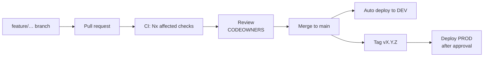

# Git workflow

Simple trunk-based flow. No `develop` branch, no release branches.



## Branches

| Prefix     | For                      | Example                        |
| ---------- | ------------------------ | ------------------------------ |
| `feature/` | New behaviour            | `feature/clinic-doctors-tab`   |
| `fix/`     | Bug fixes                | `fix/profile-version-conflict` |
| `chore/`   | Tooling, deps, refactors | `chore/bump-nx`                |
| `infra/`   | Terraform / AWS          | `infra/prod-budget-alerts`     |
| `docs/`    | Documentation only       | `docs/auth-flow`               |

`main` is protected: no direct pushes, PR + passing `CI passed` check + 1 review
(CODEOWNERS for owned paths). Squash-merge.

## Commits

Conventional Commits, checked by the `commit-msg` hook:

```
feat(api): add doctors endpoint
fix(web): keep clinic filter on refresh
infra(dev): turn on budget alerts
```

Types: `feat fix chore docs refactor test perf build ci infra revert`.
Scopes: project names (`web`, `mobile`, `api`, `shared-types`, …), or `infra`, `ci`, `docs`, `repo`.

## Hooks (Lefthook)

| When       | What runs (staged files only)                                                   |
| ---------- | ------------------------------------------------------------------------------- |
| pre-commit | gitleaks, prettier, eslint, ruff (+format), terraform fmt, file-type/size guard |
| commit-msg | Conventional Commit check                                                       |
| pre-push   | `nx affected -t typecheck`                                                      |

Heavy checks (all tests, builds, security scans, Terraform validate, Docker build) run in CI.

## Releases to production

1. Everything on `main` is already running in DEV.
2. Tag: `git tag v0.3.0 && git push origin v0.3.0` (or run _Deploy PROD_ manually with a SHA).
3. A reviewer approves the `production` environment in GitHub.
4. The pipeline builds, migrates, rolls out and smoke-tests. ECS rolls back automatically
   if the new tasks fail health checks.
